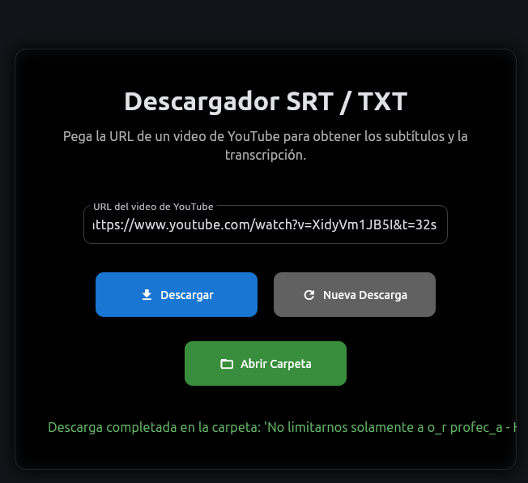
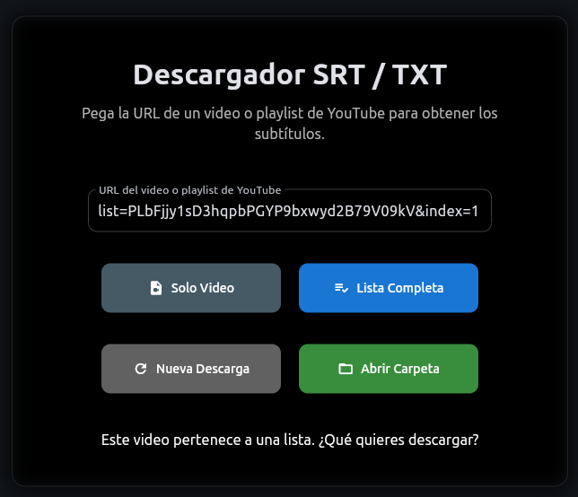

# Descargador de Subtítulos de YouTube (SRT/TXT)

Una aplicación de escritorio simple para descargar subtítulos de videos o listas de reproducción de YouTube y guardarlos como archivos `.srt` y `.txt`.




## Características

-   **Interfaz Gráfica Sencilla**: Construida con Flet para una experiencia de usuario limpia y fácil de usar.
-   **Descarga de Videos y Listas de Reproducción**: Pega la URL de un video o una lista de reproducción de YouTube.
-   **Opción de Descarga**: Si la URL contiene una lista de reproducción, puedes elegir descargar solo el video actual o la lista completa.
-   **Conversión a TXT**: Automáticamente genera una versión en texto plano (`.txt`) del subtítulo `.srt` original.
-   **Organización de Archivos**: Crea una carpeta con el título del video o de la lista de reproducción para mantener los archivos organizados.

## Requisitos

-   Python 3.x
-   `pip` (manejador de paquetes de Python)

## Instalación

1.  **Clona el repositorio:**
    ```bash
    git clone git@github.com:Ivanovichenco/srt_tex_idmji.git
    cd srt_tex_idmji
    ```

2.  **Crea y activa un entorno virtual:**
    ```bash
    # Para Linux/macOS
    python3 -m venv .venv
    source .venv/bin/activate

    # Para Windows
    python -m venv .venv
    .venv\Scripts\activate
    ```

3.  **Instala las dependencias:**
    ```bash
    pip install flet yt-dlp
    ```

## Uso

Para ejecutar la aplicación, asegúrate de que tu entorno virtual esté activado y luego corre el siguiente comando:

```bash
python main.py
```

## Compilación

Puedes crear un ejecutable para tu sistema operativo usando PyInstaller.

1.  **Instala PyInstaller:**
    ```bash
    pip install pyinstaller
    ```

2.  **Ejecuta el comando de compilación:**
    El archivo `srt_txt_downloader.spec` ya está configurado. Simplemente ejecuta:
    ```bash
    pyinstaller srt_txt_downloader.spec
    ```
    El ejecutable se encontrará en el directorio `dist`